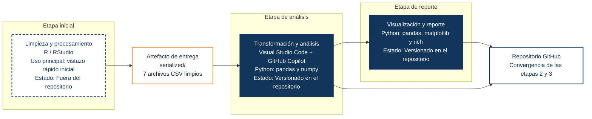

# Credicorp Capital — Value Finders

## Arquitectura del flujo de datos

```mermaid
flowchart LR
    subgraph MA["Etapa inicial"]
        A["Limpieza y procesamiento<br/>R / RStudio<br/>Uso principal: vistazo rápido inicial<br/>Estado: Fuera del repositorio"]
    end

    H["Artefacto de entrega<br/>serialized/<br/>7 archivos CSV limpios"]

    subgraph MB["Etapa de análisis"]
        B["Transformación y análisis<br/>Visual Studio Code + GitHub Copilot<br/>Python: pandas y numpy<br/>Estado: Versionado en el repositorio"]
    end

    subgraph MC["Etapa de reporte"]
        C["Visualización y reporte<br/>Python: pandas, matplotlib y rich<br/>Estado: Versionado en el repositorio"]
    end

    G["Repositorio GitHub<br/>Convergencia de las etapas 2 y 3"]

    A --> H --> B --> C --> G
    B --> G

    classDef fuera fill:#FFFFFF,stroke:#12355B,stroke-width:2px,stroke-dasharray: 6 4,color:#12355B;
    classDef versionado fill:#12355B,stroke:#12355B,stroke-width:2px,color:#FFFFFF;
    classDef entrega fill:#FFFFFF,stroke:#F28E2B,stroke-width:2px,color:#1F2937;
    classDef repositorio fill:#FFFFFF,stroke:#12355B,stroke-width:2px,color:#12355B;

    class A fuera;
    class B,C versionado;
    class H entrega;
    class G repositorio;
```

La etapa de RStudio se documenta para trazabilidad aunque su código vive fuera del repositorio.
