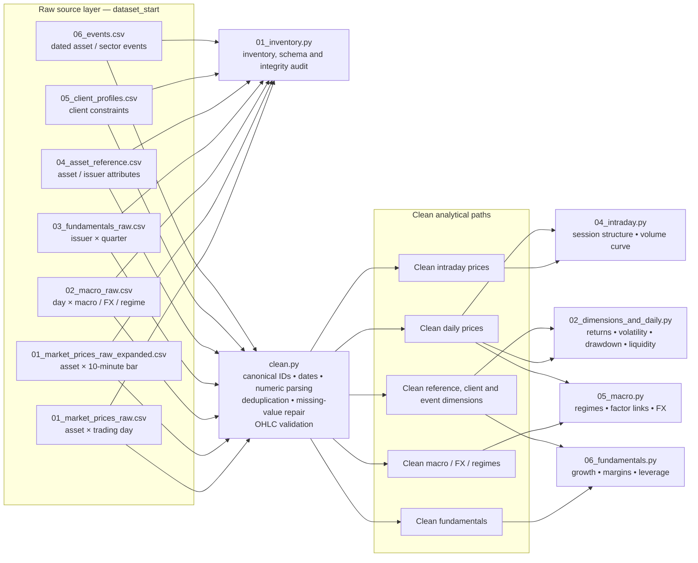
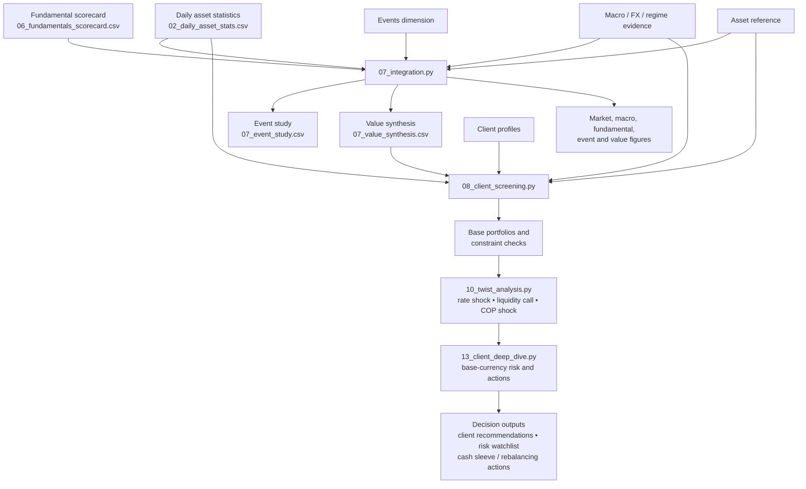
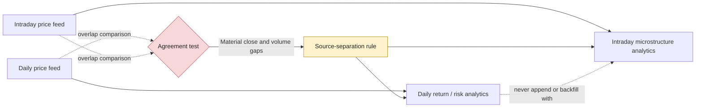
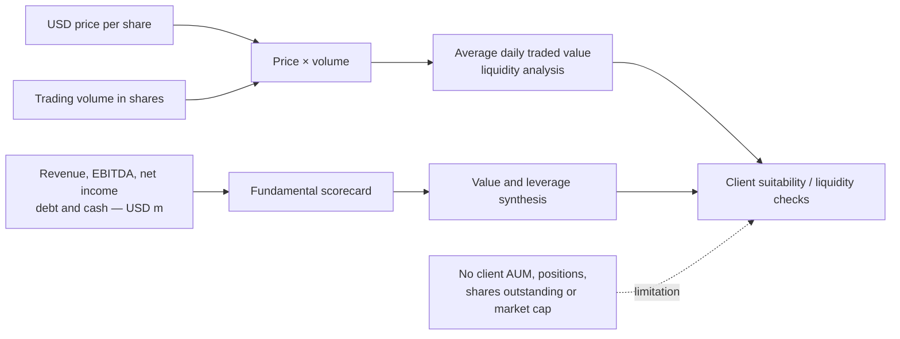

# Data Flow Architecture

This architecture documents the implemented analytical pipeline.  The daily and
intraday price feeds are deliberately kept separate after quality control: the
overlap test found material discrepancies, so they must not be spliced.

## Controls embedded in the flow

| Control | Applied before | Why it matters |
|---|---|---|
| Canonical asset and issuer IDs | All joins | Preserves reference and fundamentals links |
| Mixed date and numeric parsing | Time series and reporting | Produces consistent temporal and numeric fields |
| Duplicate removal and period resolution | Metrics and LTM calculations | Avoids double-counting observations |
| Missing-value / bad-tick repair | Price-derived returns | Prevents artificial price moves and unusable bars |
| Daily–intraday separation | All price analysis | Avoids invalidly combining inconsistent sources |
| Client base-currency checks | Final recommendations | Tests drawdown tolerance in the client’s actual currency |

## Monetary-data lineage

The pipeline carries two distinct types of money-related data:

See [`MONEY_AND_LIQUIDITY.md`](MONEY_AND_LIQUIDITY.md) for the field-level
definitions, issuer amounts and limitations.
